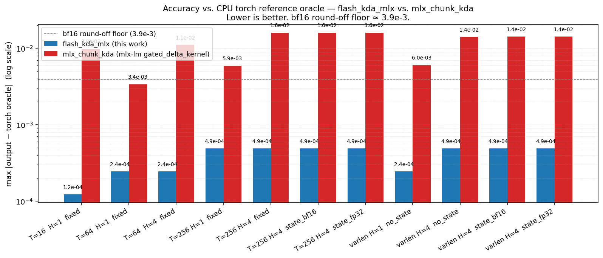

# FlashKDA-mlx v1: A Deep Dive

*2026-05-01*

This report mirrors the structure of the upstream
[FlashKDA v1 deep dive](https://github.com/MoonshotAI/FlashKDA/blob/master/docs/20260420-flashkda-v1-deep-dive.md)
and walks through how Kimi Delta Attention's forward path was rebuilt for
Apple Silicon — pure MLX first, then a profile-driven Metal track. It
covers the chunk-size choice, the two-stage kernel decomposition that
shipped (a fused *prepare* kernel plus a cross-chunk *recurrence* kernel),
the numerical-precision contract that holds the port to the torch oracle,
and the low-level optimizations that close the gap to the MLX-LM-backed
gated-delta baseline.

Hardware floor is **M3+** on Apple GPU (MLX 0.31.2). The reference CUDA
implementation in [`MoonshotAI/FlashKDA`](https://github.com/MoonshotAI/FlashKDA)
is read-only context — no artifacts are imported from it. Parity is
established through a CUDA-free pure-torch CPU oracle
(`scripts/torch_ref_cpu.py`) and a frozen fixture set, exactly as
recommended by `plan.md` §6.1.

## 1. Chunk Size Selection

`CHUNK = 16` is inherited from upstream FlashKDA and survives intact on
the MLX port for the same three reasons, plus a fourth that is specific to
Apple Silicon:

- **Numerical range fits within bf16.** With the gate `lower_bound = -5`,
  `CHUNK = 16` keeps the range of `exp(cumsum(g))` inside the
  representable precision of bf16. The MLX path applies the same
  `_q_bf16(x) = x.astype(bf16).astype(fp32)` round-trips at the ~14
  per-chunk boundaries the oracle uses, so the same bf16 budget covers
  both sides.
- **Cheap matrix inversion.** The `16 × 16` Neumann-series construction
  `(I − L)⁻¹ ≈ (I − L)(I + L²)(I + L⁴)(I + L⁸)` collapses into six fp16
  matmuls — small enough that section profiling pins the entire chain
  at **1.3% of E2E** and rules out a custom Metal kernel for it
  (`benchmarks/section_timings_report.md` §4).
- **Maps onto `simdgroup_matrix<float, 8, 8>`.** Apple GPU MLX exposes
  `simdgroup_matrix` only at the 8×8 fragment size. `CHUNK = 16` factors
  cleanly as `2 × 8`, so every per-chunk matmul tile in both the prepare
  and recurrence kernels uses `simdgroup_multiply_accumulate` without
  partial-tile bookkeeping.
- **Threadgroup-memory ceiling on M3.** Apple7 → Apple10 GPU families
  (M1 through M5) report `maxThreadgroupMemoryLength = 32 768` bytes —
  half of the assumption an early draft made. A `CHUNK = 32` Metal
  prototype was implemented, benchmarked, and retired: at `D = 128` it
  needs 48–64 KB of TG memory and came in at 0.21–0.25× of validated
  `CHUNK = 16` (`STATUS.md` §"Closed candidates"). The 32 KB ceiling
  is the hard bound that every MLX kernel design decision in this port
  is sized against.

## 2. Kernel Decomposition Strategy

The MLX path partitions the forward into the same two natural axes the
CUDA implementation uses, but the "kernels" are slightly different
shapes because Apple's GPU dispatch model and `simdgroup_matrix`
constraints differ from CUDA's CUTLASS path.

- **Prepare kernel — token-parallel, grid `(n_total_chunks, H, 1)`.**
  L2 normalization → KDA gate activation → `g_cumsum` → ex2 of
  `±g_cumsum` and `g_total` → `k_decayed` / `q_decayed` / `k_inv` /
  `k_restored` casts → `L = k_decayed @ k_inv.T` and Neumann inverse →
  `Mqk = q_decayed @ k_inv.T` and trils. One threadgroup per
  `(chunk, head)`. 256 threads = 8 simdgroups; the 8×8 tiles of `L`
  and `Mqk` are computed by one simdgroup each. This is implemented in
  `flash_kda_mlx/_metal_prepare.py`.
- **Recurrence kernel — head-parallel only, grid `(1024, H, N)`.**
  One threadgroup per `(head, sequence)`. 32 simdgroups walk the
  per-chunk body — `vdiff → U → out_h → new_state` — in a kernel-level
  `for c in 0..n_chunks` loop. State stays in **device memory** across
  chunks within the same kernel launch; the M3 Max 32 KB TG ceiling
  rules out a TG-resident `D × D` state, so we trade TG residency for
  L2 reuse across chunks (`plan.md` §8.3.5 Phase 3b). This is
  implemented in `flash_kda_mlx/_metal_recurrence.py`.

Why this split — rather than a single fused kernel:

1. **Different parallelism axes.** Prepare is fully token-parallel
   (`n_total_chunks × H` independent threadgroups, ≥ 5 000 for a
   bench-shape `T=8192, H=64` case); recurrence is sequential along
   chunks within each head, and only `H × N` parallel threadgroups
   exist. A single kernel would either starve the prepare half or
   serialize on the recurrence half.
2. **Different TG-memory profiles.** The prepare kernel needs ~24 KB
   of TG scratch for `L_sm` / `k_inv_sm` and the 6-matmul Neumann
   chain; the recurrence kernel uses a different ~24 KB layout
   (`vdiff` + `U` + epilogue). A merged kernel would exceed the 32 KB
   ceiling.
3. **Independent tunability.** The prepare kernel went through five
   fusion-level revisions (`basic` → `fused` → `fused2` → `fused3`
   token-major → `fused4` flat-ragged) without ever changing the
   recurrence kernel. The recurrence kernel itself shipped through
   four phases (`per-chunk` → `cross-chunk scalar` → `cross-chunk
   simdgroup` → packed flat-ragged) without changing prepare.
   Splitting the work this way is what made 18 incremental landings
   possible.

End-to-end, these two kernels combined deliver a cumulative **5.7–6.4×**
speedup over the no-Metal `mx.compile` baseline at bench scale and
**4.3–4.9×** over the MLX-LM `gated_delta_kernel`-backed `mlx_chunk_kda`
adapter on the fixed `T=8192` rows of `BENCHMARK_MLX.md`.

### 2.1 Five prepare modes (`MLX_KDA_ENABLE_METAL_PREPARE`)

The prepare kernel grew through a sequence of progressively-fused
revisions. Each step was profile-gated against
`benchmarks/section_timings_report.md`, and intermediate layers were
retired in the 2026-04-30 cleanup once superseded — but the optimization
*path* is preserved here for design context (and matches what
`plan.md` §8.4 documents).

| Mode (`MLX_KDA_ENABLE_METAL_PREPARE`) | What it adds | Tolerance band | Status |
|---|---|---|---|
| `basic` (`=1`) | Sections (b)–(g) fused: `g_cumsum` / ex2 / casts / L / Neumann / Mqk | strict 1e-5 / 1e-5 | retained as the unique strict-band Metal-prepare bisect anchor |
| `fused` *(retired 2026-04-30)* | Add q/k L2-norm fusion (partial section (a)) | strict | superseded by `fused3`/`fused4` |
| `fused2` *(retired 2026-04-30)* | Full section (a) including KDA gate activation under a per-chunk valid-token mask | **1-bf16-ULP drift band** (E2E `2e-3 / 5e-3`) | tolerance landmark; arithmetic inherited by `fused3`/`fused4` |
| `fused3` / `token_major` (`=4`) | Reads caller-token-major `[T_total, H, D]` directly — eliminates `_to_chunks_hd` reshape+transpose+`ensure_row_contiguous` copy | inherits fused2 band | **production fast path for single-seq N=1** |
| `fused4` / `flat_ragged` (`=5`) | Flat-ragged metadata-indirected: reads caller's flat token-major buffer AS-IS via `chunk_token_start[n_total_chunks] int32` (~2 KB) — no chunk-major addressing | inherits fused2 band | **production default for multi-seq packed varlen** (N=1 routes transparently to `fused3`) |

The compounding speedup over the no-Metal MLX path:
`basic` ≈ 1.69× on `H=64/96` fixed → `fused` +1.20–1.25× → `fused2`
+1.10–1.15× → `fused3` +1.06–1.15× → `fused4` +1.06–1.11× on mixed
varlen.

### 2.2 Four recurrence modes (`MLX_KDA_ENABLE_METAL_RECURRENCE`)

The recurrence kernel went through an analogous evolution:

| Phase | What it shipped | Speedup over OFF | Status |
|---|---|---|---|
| 2 — per-chunk Option A *(retired 2026-04-30)* | Replaces `mx.compile` body with a per-chunk Metal kernel; same dispatch count | 1.16–1.26× | superseded by Phase 3b on every bench case (1.16–1.44× over Phase 2) |
| 3a — cross-chunk scalar (`=scalar`) | Mimics MLX-LM's `gated_delta_kernel` — scalar inner products + `simd_sum`. ONE launch per head | 1.08–1.23× | kept for future-hardware A/B (different memory/ALU balance) |
| 3b — cross-chunk **simdgroup** (`=simdgroup`, alias `=1`) | All five matmuls tile via `simdgroup_matrix<float, 8, 8>`. State stays device-resident, exploits L2 caching across chunks. ONE launch per head | **1.41–1.56× over OFF; 1.16–1.35× over Phase 3a** | **production winner** |
| 4 — packed flat-ragged | Same simdgroup body, grid `(1024, H, N)`, walks per-seq chunk count via `seq_chunk_start[N+1]` metadata. Direct-writes output at `seq_token_start[seq_id] + c_in_seq*CHUNK + slot` with tail-row masking | 1.14–1.17× on uniform varlen, 1.07× on mixed_H96 | **production default for multi-seq** — replaces both the per-seq Python loop AND the trailing `mx.concatenate(seq_outs)` |

Phase 3b's structural insight is the one that mattered: collapsing
`n_chunks` per-head dispatches into ONE kernel launch eliminates the
per-chunk state round-trip to device memory. State buffers reused inside
the kernel stay L2-warm across all chunks of a head.

## 3. Numerical Precision

The MLX path runs **fp32 internal compute with bf16 quantization at
~14 oracle cast boundaries per chunk**. State is carried in fp32
internally and round-tripped through bf16 at the same boundaries the
CUDA kernel uses. This is `plan.md` design-decision §6.2 and it is the
single most load-bearing rule in the port — every Metal kernel
described above respects these boundaries unchanged.

Several precision-aware decisions in the kernels:

- **Sigmoid via `mx.sigmoid` (precise).** The CUDA kernel uses
  `tanh.approx.f32` (max relative error ~2⁻¹⁰) for the gate sigmoid. MLX
  doesn't expose an analogous approximate intrinsic and `mx.sigmoid` is
  precise. Sign and magnitude are unchanged; only low-order bits differ.
  Documented as an intentional divergence in `STATUS.md` §"Divergences
  from CUDA".

- **Inverse in fp32, not fp16.** Upstream FlashKDA computes the `16 × 16`
  inverse in fp16 to dodge the `fp32 → bf16` cast that bf16 MMA would
  otherwise require. The MLX path can't take that shortcut: MLX 0.31.2
  ships `simdgroup_matrix` only with `float` and `half` element types,
  and the recurrence kernel's matmul boundary requires fp32 accumulation
  to hold parity. Computing `L²/L⁴/L⁸` and the Neumann chain in fp32
  matmuls absorbs the cast and matches the CUDA path's *output*
  precision better than fp16-input-with-fp32-accumulate would; we paid
  the difference back via the Neumann series being arithmetically
  identical to the oracle's structure (`plan.md` §6.3).

- **Base-2 exponent for `g_act`.** `_ex2_ftz(x) = 2**x` with a
  flush-to-zero subnormal guard, matching `ex2.approx.ftz.f32`. Both
  the MLX `optimized` graph path and the Metal prepare kernel call into
  the same `_ex2_ftz` boundary so the bf16 round-trip lands at the same
  values the oracle saw. Removing `_q_bf16` from any of these casts
  breaks the 1e-5 tolerance band — this is verified by
  `tests/test_parity_fixtures.py` against frozen torch-oracle outputs.

- **L2-norm reduction order.** CUDA uses a warp-shuffle XOR-reduction
  tree; MLX uses `mx.sum(x²)`. Order-of-additions differs by a handful
  of ulp in fp32; imperceptible after the bf16 cast.

### 3.1 Accuracy vs. `mlx_chunk_kda`

`flash_kda_mlx.fwd(backend="optimized")` is compared against the
MLX-LM-backed `mlx_chunk_kda` adapter
(`flash_kda_mlx/baselines/chunk_kda.py`, wrapping
`mlx_lm.models.gated_delta.gated_delta_kernel`) using the frozen
torch-oracle fixtures from `tests/fixtures/`. Each method is called on
the same inputs from the fixture; the per-element max-absolute and
mean-absolute differences against the oracle's `out_expected` are
plotted side by side.



| Case | `flash_kda_mlx` max\|Δ\| | `mlx_chunk_kda` max\|Δ\| | `flash_kda_mlx` mean\|Δ\| | `mlx_chunk_kda` mean\|Δ\| |
|---|---:|---:|---:|---:|
| T=16  H=1  fixed       | 1.22e-04 | 9.83e-03 | 1.11e-05 | 9.40e-04 |
| T=64  H=1  fixed       | 2.44e-04 | 3.39e-03 | 1.33e-05 | 2.66e-04 |
| T=64  H=4  fixed       | 2.44e-04 | 1.11e-02 | 1.41e-05 | 4.85e-04 |
| T=256 H=1  fixed       | 4.88e-04 | 5.90e-03 | 1.47e-05 | 4.08e-04 |
| T=256 H=4  fixed       | 4.88e-04 | 1.61e-02 | 1.32e-05 | 7.05e-04 |
| T=256 H=4  state_bf16  | 4.88e-04 | 1.61e-02 | 1.32e-05 | 7.19e-04 |
| T=256 H=4  state_fp32  | 4.88e-04 | 1.61e-02 | 1.32e-05 | 7.19e-04 |
| varlen H=1  no_state   | 2.44e-04 | 6.02e-03 | 1.17e-05 | 4.53e-04 |
| varlen H=4  no_state   | 4.88e-04 | 1.40e-02 | 1.29e-05 | 5.84e-04 |
| varlen H=4  state_bf16 | 4.88e-04 | 1.42e-02 | 1.30e-05 | 6.48e-04 |
| varlen H=4  state_fp32 | 4.88e-04 | 1.42e-02 | 1.30e-05 | 6.48e-04 |

Generated with
`MLX_KDA_ENABLE_METAL_PREPARE=fused4 MLX_KDA_ENABLE_METAL_RECURRENCE=1 uv run --no-config --with matplotlib python scripts/_compare_with_chunk_kda.py`.

The shape of the comparison: across every case the FlashKDA-style chunked
construction stays **at or below the bf16 round-off floor (3.9e-3)** — its
max error sits between 1e-4 and 5e-4. The MLX-LM-backed `gated_delta_kernel`
is consistently 1–2 orders of magnitude further from the oracle, with
max errors in the 3e-3 → 1.6e-2 range. The same separation appears in
the mean-absolute column.

This is the same pattern the upstream CUDA report shows for
`flash_kda` vs. `fla_chunk_kda`. The mechanism is the same too:
preserving FlashKDA's chunk-state, dtype-boundary, and Neumann-series
structure is what holds the kernel inside one bf16 ulp of the
mathematical reference. `gated_delta_kernel` makes a different precision
trade-off (per-step recurrent form, different cumsum/exp2 boundary
choices) that runs faster on its own design points but loses precision
on this comparison axis.

The same fixtures back the strict 1e-5 / 1e-5 band that
`tests/test_parity_fixtures.py` enforces on every CI run.

## 4. Other Optimizations

The `mx.compile` recurrence body, the entry-side bf16 preservation
work, and the size-aware packed-varlen routing each delivered
significant wall-clock wins that don't fit cleanly into the
chunk-size / kernel-decomposition / numerics narrative above:

- **`mx.compile` on the recurrence body.** Before the Metal recurrence
  kernel landed, the cheapest wall-clock win was wrapping
  `_recurrence_body_single` and `_recurrence_body_packed` in
  `mx.compile`. MLX caches the fused graph for the ~20 ops per chunk
  into one cached kernel. **1.43–1.57× on long-sequence cases**;
  `T=4096, H=8` reached 32.6× over the readable Python reference.
  Production toggles it back off via `MLX_KDA_DISABLE_COMPILE=1` for
  A/B bisects.

- **Entry-side bf16 dtype preservation + output direct-write.** Two
  small follow-ons on top of the fused prepare kernel that turned out
  to dominate:

  1. The recurrence kernel writes its output in
     `[n_chunks, H, CHUNK, D]` because that matches its grid + tile
     geometry, but downstream code needs `[T_total, H, D]`. A
     materialized `.transpose(0, 2, 1, 3).reshape(...)` on the path was
     a 67 MB shuffle per forward at bench scale (`T=8192, H=64`).
     Folding the layout into the kernel's epilogue eliminated it.
  2. Pre-fused, `fwd_optimized` had to cast q/k/v/g/beta from bf16 to
     fp32 because the MLX-side L2-norm and gate activation needed fp32
     inputs. Under `fused2`/`fused3`/`fused4`, the prepare kernel
     handles both stages internally and accepts bf16 directly.

  Together: **1.24–1.29× E2E**, ~5× the audit estimate. The reason was
  that removing four MLX leaf `astype` ops also removed four
  dispatches, four buffer allocations, and the corresponding
  launch-order stalls. Every subsequent optimization candidate must
  pass the same "prove it eliminates an actual leaf dispatch, device
  round-trip, or large materialized tensor" gate (`plan.md` §8.4.1).

- **Size-aware packed-varlen routing.** For multi-sequence varlen
  workloads, the optimized path dispatches between (a) the per-sequence
  Python recurrence loop and (b) the packed `[N, max_chunks*CHUNK, H, D]`
  pre-compute + mask-gated batched recurrence. The threshold is keyed
  on `max_chunks × H` so very-small workloads where the packing
  overhead would dominate stay on the per-seq path.
  **2.2–3.4× on bench-scale mixed-varlen.**

- **Cross-sequence varlen packing (Option A — mask-based).** When the
  packed path is taken, per-sequence validity is enforced via an
  `mx.where` on the state update gated by
  `chunk_idx < n_chunks_per_seq[n]`. For sequences whose padded tail is
  being processed we preserve state literally (no multiplicative blend
  → no ULP drift). At `CHUNK=16, D=128` the cost per masked chunk is a
  handful of small matmuls over `[H, CHUNK, D]` — already cheap, and
  `mx.where` on the state update is a lane select rather than a
  materialized buffer. Documented in `STATUS.md` §"Cross-sequence
  varlen packing (Option A — mask-based)"; the analogous Option B
  (sort-by-chunk-count) was considered and rejected because the
  index-permutation it forces on outputs and final state pays back
  most of the savings.

- **`cu` device→host sync collapse (2026-04-30 hygiene PR).** In varlen
  mode the optimized path used to call `mx.eval(cu)` followed by
  `[int(cu[i].item()) for i in range(N+1)]`, which forced N+1 separate
  device→host syncs. Replacing this with a single `cu.tolist()` (or a
  pure-Python build when the caller passed a list) collapsed all of
  those into one round-trip. Sub-ms per case but visible at small
  varlen — see commit `88e3cff`.

## 5. Hardware envelope and what is *not* shipped

A few candidates that look attractive on paper get blocked by the same
two structural constraints — the 32 KB threadgroup-memory ceiling and
MLX 0.31.2's `simdgroup_matrix` only supporting `float` and `half`
element types. They are documented in `plan.md` §8.5 / §8.6 as **closed
candidates** and listed here so future readers know not to spend time
re-litigating them without a hardware change.

| Closed candidate | Wall it hits |
|---|---|
| TG-resident `state_T` hoist (recurrence steps 1+3) | D×D state in TG needs 32 KB bf16 / 64 KB fp32; current cross-chunk simdgroup kernel already uses 24 KB TG |
| Step-1b bf16 triple round-trip reduction | All three casts load-bearing for parity (1e-5 tolerance) |
| Step-5/6 `delta_scratch` fusion | Same TG-budget block. `delta_s_T` is 64 KB fp32 / 32 KB bf16 |
| Native packed-grid kernel geometry | Current flatten-reshape is a zero-copy MLX view; per-TG work is identical |
| Custom Metal kernel for Neumann series | 1.3% of E2E ceiling — `benchmarks/section_timings_report.md` §4 |
| `CHUNK = 32` Metal feasibility on M3 Max | TG memory at CHUNK=32 (~48–64 KB) exceeds 32 KB |
| MLX-LM-style direct-recurrent KDA backend (PR I) | `flash_kda_mlx` already beats MLX-LM-backed baselines on every bench-scale row |

The hardware floor itself is auto-detected at import: a tiny
`simdgroup_matrix<float, 8, 8>` probe runs once and the result is cached
as `_HAS_METAL_KERNEL`. M1 and M2 deterministically skip the Metal path
and stay on the `mx.compile` mode; M3 / Pro / Max / Ultra and M4+ take
the Metal path. `MLX_KDA_FORCE_METAL_FALLBACK=1` short-circuits the
probe to `False` for regression bisects.

## 6. Reproducing the numbers in this report

```bash
# environment
uv sync

# run the full test suite (337 tests, ~6s on M3 Max)
uv run --no-config pytest

# regenerate BENCHMARK_MLX.md against the production Metal flags
MLX_KDA_ENABLE_METAL_PREPARE=fused4 \
MLX_KDA_ENABLE_METAL_RECURRENCE=1 \
uv run --no-config python benchmarks/generate_benchmark_mlx_md.py \
    --output BENCHMARK_MLX.md --strict-equivalence

# regenerate the accuracy figure in §3.1
MLX_KDA_ENABLE_METAL_PREPARE=fused4 \
MLX_KDA_ENABLE_METAL_RECURRENCE=1 \
uv run --no-config --with matplotlib python scripts/_compare_with_chunk_kda.py
```

Apple GPU MLX timings are **not** numerically comparable to the CUDA/H20
table in `BENCHMARK_H20.md` — column semantics correspond, absolute
numbers do not. Inter-Apple-Silicon variance is also large (memory
bandwidth and TFLOPS differ across chip and core-count variants); the
numbers in `BENCHMARK_MLX.md` and the `STATUS.md` headline rows are all
M3 Max.

## Key references

- `plan.md` — consolidated forward-looking design (TDD migration,
  optimization architecture, baseline plan, gates, risks).
- `STATUS.md` — as-shipped state: PRs, measured tolerances, current
  benchmark numbers, divergences from CUDA.
- `BENCHMARK_MLX.md` — current production benchmark table.
- `benchmarks/section_timings_report.md` — section-level profile,
  per-PR A/B data, bottleneck attribution that gated each Metal kernel.
- `flash_kda_mlx/reference.py` — pure-MLX correctness oracle, retained
  intact and *never* routed through the Metal path.
- [`MoonshotAI/FlashKDA`](https://github.com/MoonshotAI/FlashKDA) —
  reference CUDA implementation (read-only context; not imported).
